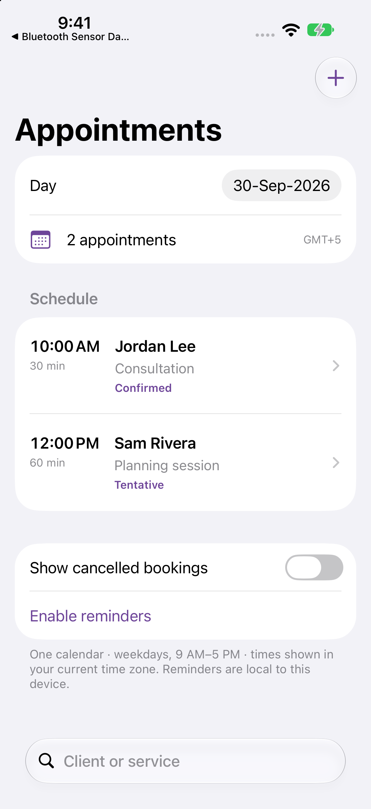

# Appointment Scheduler

Manage one appointment calendar without requiring an account or backend.

**iOS 15+ · iPhone and iPad · SwiftUI · MIT**



## What it does

- Create and edit client bookings, service duration, contact details, notes, and status.
- Reject overlapping bookings while allowing appointments that meet at the same boundary.
- Find available 15-minute start slots within Monday–Friday, 9 AM–5 PM business hours.
- Treat tentative bookings as reserved time; cancellation frees the slot and preserves the record.
- Request optional local reminders 15 minutes before a booking.
- Export an escaped, UTF-8-folded `.ics` calendar file with UTC timestamps.

## Run

Open `Appointment Scheduler.xcodeproj`, choose the shared **Appointment Scheduler** scheme, and run on an iPhone simulator or device. No third-party packages are required. Use your own signing team for a physical device; no developer-team identifier is committed.

Bundle ID: `com.dd.appointmentscheduler`. The deployment target is iOS 15. Initial builds were checked with Xcode 27; older OS runtime compatibility is not implied by a successful build. Xcode 16 or later is recommended for opening the project.

## Try it

Create a weekday consultation at 10 AM. Add another at 10:15 AM and confirm the conflict is explained. Book 10:30 AM successfully, cancel the first appointment, and check that its slot is available again. Export a booking to inspect the calendar file.

Choose **Enable reminders**, then turn on a reminder in a booking at least 15 minutes in the future. The system controls notification delivery; simulator behavior is not a guarantee of device delivery.

## Structure

`BookingRules` validates complete booking intervals and computes free starts using an injected calendar. `CalendarFile` handles RFC 5545 escaping, UTC formatting, stable event identity, and byte-aware line folding. `ScheduleStore` persists changes atomically before requesting notifications. Reminder refreshes are serialized, and canceled bookings remove pending reminders. SwiftUI screens share the same validation path for edits and new bookings.

## Verification

```sh
swift test
xcodebuild -project "Appointment Scheduler.xcodeproj" -scheme "Appointment Scheduler" \
  -destination 'generic/platform=iOS Simulator' CODE_SIGNING_ALLOWED=NO build
```

Core tests cover interval boundaries, conflicting tentative bookings, editing without self-conflicts, cancellation, business-hour limits, past-slot filtering, persistence identity, UTC calendar export, injection-safe escaping, and UTF-8 folding.

The GitHub Actions workflow runs core tests and a simulator build. Review the actual workflow result in Actions rather than treating a badge or local build as proof of device behavior.

## Scope and limitations

This is a single-device, single-resource scheduler. Business hours and example services are defined in code. It does not support multiple staff calendars, accounts, payments, server sync, client notifications, or automatic invitations. Dates are stored as absolute instants and displayed in the device’s current time zone; changing time zone changes displayed times. Exporting a calendar file is a manual copy, not two-way synchronization. Calendar clients decide how to handle repeat imports of the same UID.

Reminders are optional, use generic lock-screen text, and schedule the next 60 eligible appointments. Reopening the app refreshes the queue. A booking less than 15 minutes away has no 15-minute reminder. Delivery depends on OS permission, Focus, and device settings.

## Data and privacy

[PRIVACY.md](PRIVACY.md) describes storage, permissions, and sharing. Any sample clients and demo readings are fictional.

## License

[MIT](LICENSE), including original app artwork. See [Scripts](Scripts/README.md) to regenerate icons.
